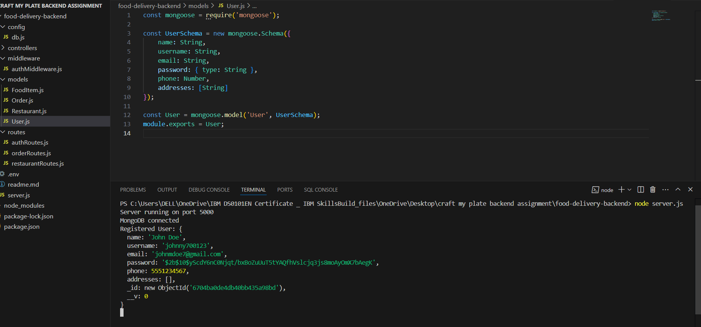
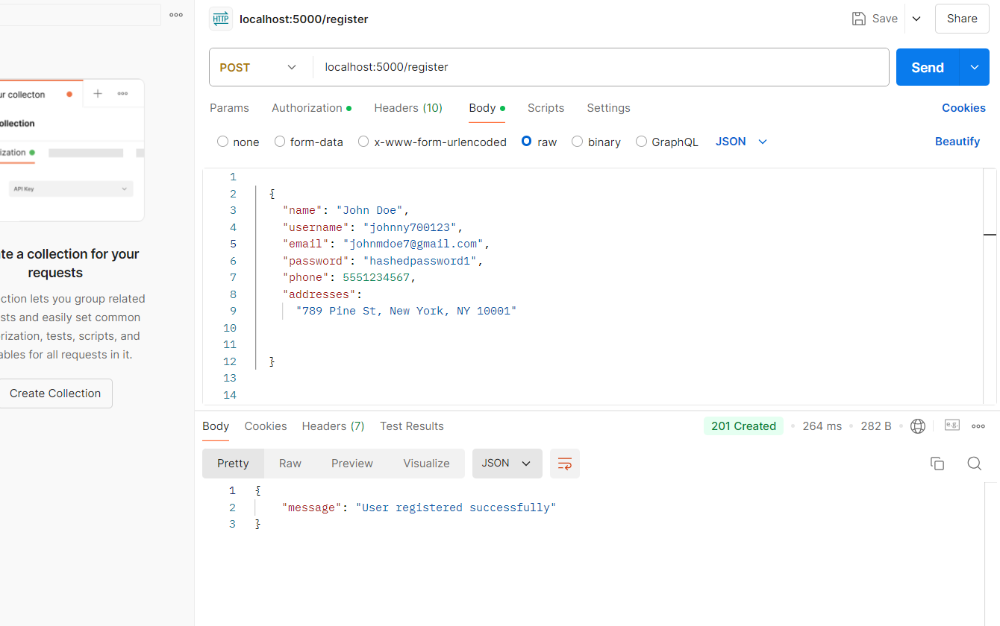
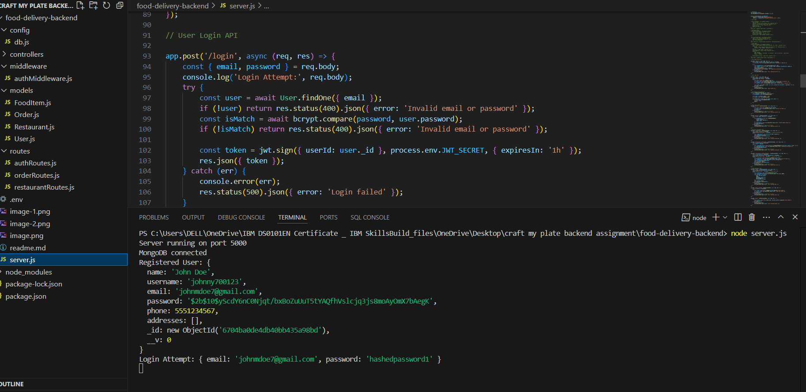
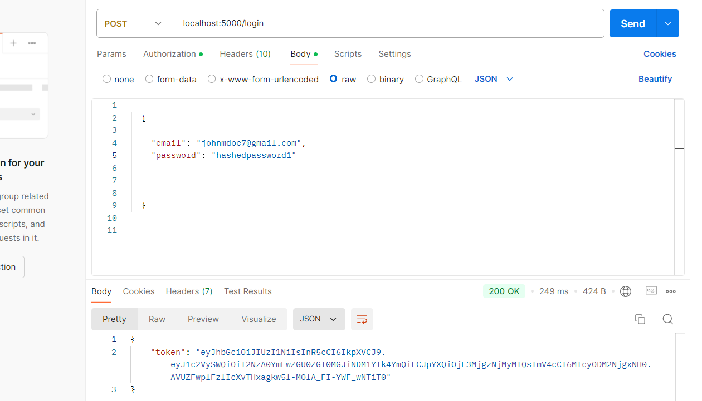
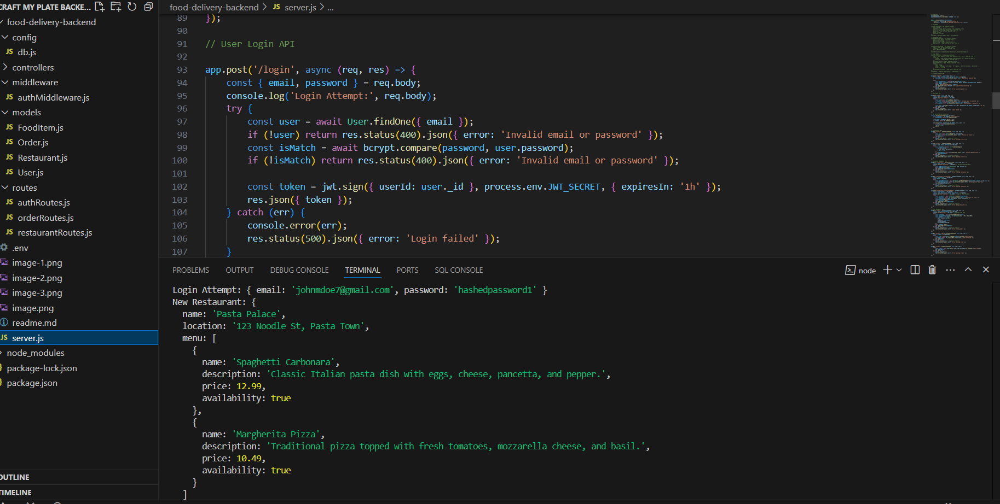
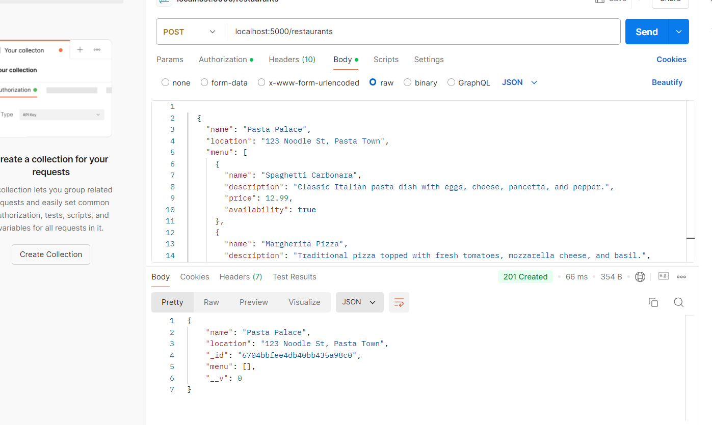
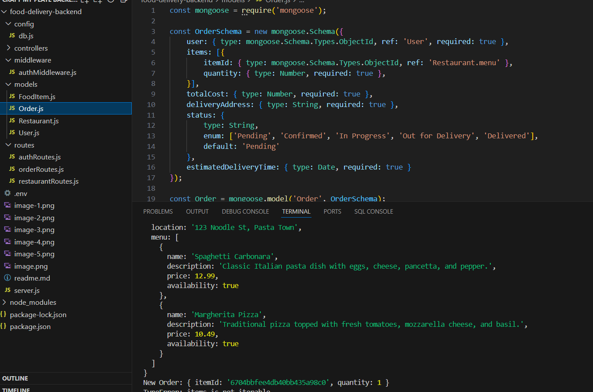

# Food Delivery Backend API

## Description
The Food Delivery Backend API is a RESTful API designed to manage restaurants and orders for a food delivery application. It provides functionality for creating, reading, updating, and deleting restaurant and order data.

## Table of Contents
- [Technologies Used](#technologies-used)
- [Installation](#installation)
- [API Endpoints](#api-endpoints)
- [Example JSON Data](#example-json-data)
- [Usage with Postman](#usage-with-postman)
  

## Technologies Used
This project uses the following technologies:
- **Node.js**: A JavaScript runtime for building server-side applications.
- **Express.js**: A web application framework for Node.js to build APIs.
- **MongoDB**: A NoSQL database for storing application data.
- **Mongoose**: An Object Data Modeling (ODM) library for MongoDB.
- **Body-parser**: Middleware for parsing incoming request bodies.
-**Postman**:TO check the code working or not and check the API operations 

## Installation
To set up the Food Delivery Backend API on your local machine, follow these steps:

1. **Clone the Repository**:
   - Start by cloning the project repository from GitHub to your local machine. This action will create a copy of the code on your device.

2. **Install Node.js and npm**:
   - Ensure that you have Node.js and npm installed. These tools are essential for running the application and managing dependencies.

3. **Install Project Dependencies**:
   - Navigate to the project directory and install all necessary packages. This will set up the environment and allow you to run the API.

4. **Set Up MongoDB**:
   - If you do not have MongoDB installed, download and install it on your machine. Alternatively, you can use a cloud MongoDB service. Make sure to create a new database for your application.

5. **Configure Environment Variables**:
   - If your application requires environment variables (such as the MongoDB connection string), set them up in a configuration file or your environment settings.

6. **Start the Server**:
   - Run the command to start the server. This will launch the API, and you should see a message indicating that the server is running.

7. **Access the API**:
   - Use an API client like Postman to interact with the API. You can send requests to the API endpoints you have set up.

## API Endpoints
The API consists of several endpoints for managing restaurants and orders. Each endpoint allows you to perform various operations such as creating, retrieving, updating, and deleting records.

### Register

- first user register user detalis that are stored in db
- Those details are used in the whether user login process.
- In register we use post APi operation done.

this is postman pic success 

### Login

- Whether user login the JWT Token will be generated.
- that token put into postman authentication that token put bearer token that will give access to the Restaurants and Order process of  API 

VSC terminal after login process completed

It will give the JWT Token in the postman terminal see in this pic 

### Restaurants
- Create a new restaurant
- Retrieve all restaurants
- Get details of a specific restaurant by ID
- Update a restaurant's information
- Delete a restaurant

### Orders
- Place a new order
- Retrieve all orders
- Get details of a specific order by ID
- Update an order
- Delete an order

## Example JSON Data
This section includes sample data that can be used for testing the API. It provides examples of what the JSON structure looks like for both restaurants and orders.

### Dummy Restaurants Data
A sample list of restaurants with details such as name, location, cuisine, and menu items.

### Dummy Orders Data
A sample list of orders including items and delivery addresses.

## Usage with Postman

1. **Creating Restaurants**:
   - Use the POST method to add new restaurants to the database. Provide the required restaurant information in the request body.

in postman 

2. **Retrieving Data**:
   - Use the GET method to fetch all restaurants or specific restaurant details by their ID.

3. **Updating Restaurants**:
   - Use the PUT method to modify existing restaurant information. Include the updated data in the request body.

4. **Deleting Restaurants**:
   - Use the DELETE method to remove a restaurant from the database.

5. **Managing Orders**:
   - Similarly, use the POST, GET, PUT, and DELETE methods to manage orders.

